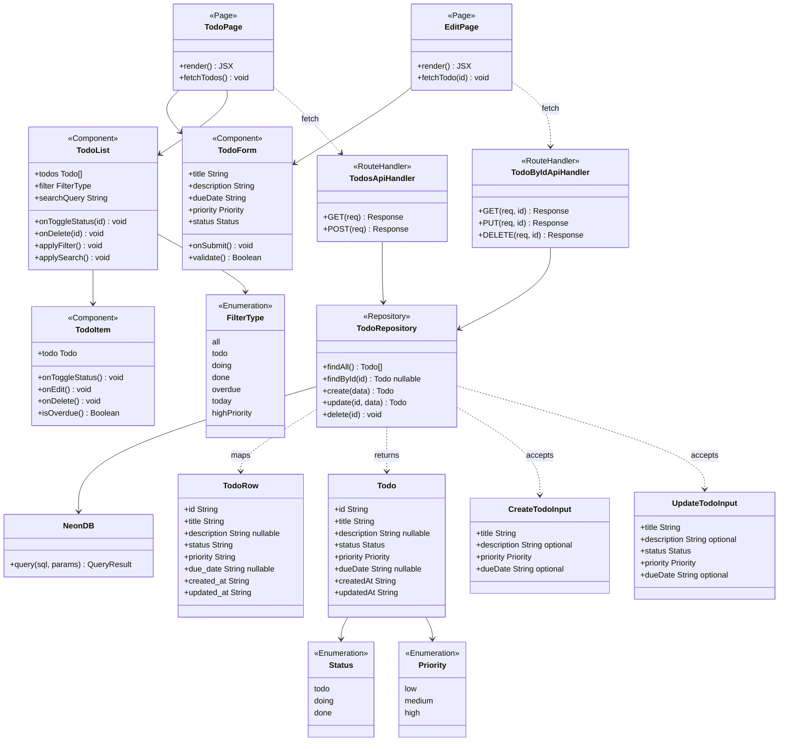

# クラス図（モジュール構成・依存関係）

Next.js App Router + Route Handler 構成のため、厳密なクラスは存在しない。  
本図では **ページ・API・ DB アクセス層・型定義** の責務と依存関係を `classDiagram` で表現する。

## クラス図



## 責務説明

### ページ（app/）

| コンポーネント | ファイルパス例 | 責務 |
|----------------|---------------|------|
| TodoPage | `app/page.tsx` | 一覧画面。全タスク取得・フォーム・一覧コンポーネントを組み合わせる |
| EditPage | `app/todos/[id]/edit/page.tsx` | 編集画面。タスク取得・編集フォームを表示する |

### コンポーネント（components/）

| コンポーネント | ファイルパス例 | 責務 |
|----------------|---------------|------|
| TodoForm | `components/TodoForm.tsx` | 追加・編集フォーム。バリデーションを担う |
| TodoList | `components/TodoList.tsx` | 絞り込み・検索・ソートを担う。TodoItem を一覧表示する |
| TodoItem | `components/TodoItem.tsx` | 各タスクの表示・完了切替・削除を担う |

### API Route Handler（app/api/）

| ハンドラー | ファイルパス例 | 責務 |
|------------|---------------|------|
| TodosApiHandler | `app/api/todos/route.ts` | GET（全件取得）・POST（新規作成） |
| TodoByIdApiHandler | `app/api/todos/[id]/route.ts` | GET（1件取得）・PUT（更新）・DELETE（削除）。PUT は有効な status 値を受け入れる（遷移制約は UI 側で管理） |

### データアクセス層（lib/）

| クラス | ファイルパス例 | 責務 |
|--------|---------------|------|
| TodoRepository | `lib/todo-repository.ts` | SQL を組み立てて Neon に問い合わせる。DB の snake_case（TodoRow）を camelCase（Todo）に変換する責務を持つ |
| NeonDB | `lib/db.ts` | `@neondatabase/serverless` のラッパー。接続プールを管理する |

### 型定義（types/）

| 型 | ファイルパス例 | 内容 |
|-----|---------------|------|
| Todo | `types/todo.ts` | DB レコードに対応するドメイン型（camelCase） |
| TodoRow | `types/todo.ts` | DB から取得したローレコード型（snake_case）。Repository 内部でのみ使用 |
| CreateTodoInput | `types/todo.ts` | 新規作成時の入力型 |
| UpdateTodoInput | `types/todo.ts` | 更新時の入力型 |
| Status | `types/todo.ts` | `todo \| doing \| done` |
| Priority | `types/todo.ts` | `low \| medium \| high` |
| FilterType | `types/todo.ts` | フロントエンドの絞り込み条件型 |

## 定数定義（暫定）

```typescript
// types/todo.ts
export const STATUS = {
  TODO: 'todo',
  DOING: 'doing',
  DONE: 'done',
} as const;

export const PRIORITY = {
  LOW: 'low',
  MEDIUM: 'medium',
  HIGH: 'high',
} as const;

export type Status = typeof STATUS[keyof typeof STATUS];
export type Priority = typeof PRIORITY[keyof typeof PRIORITY];
```
