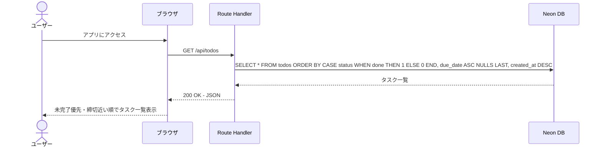
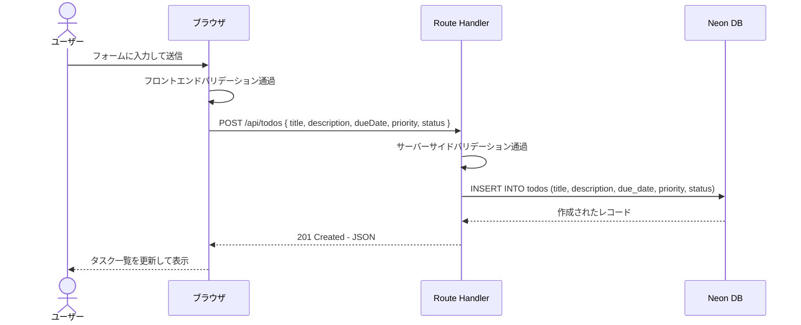
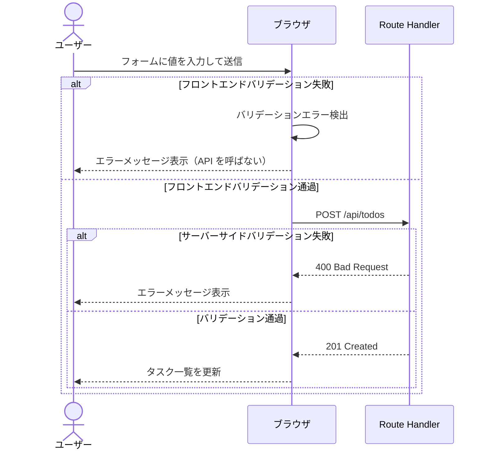
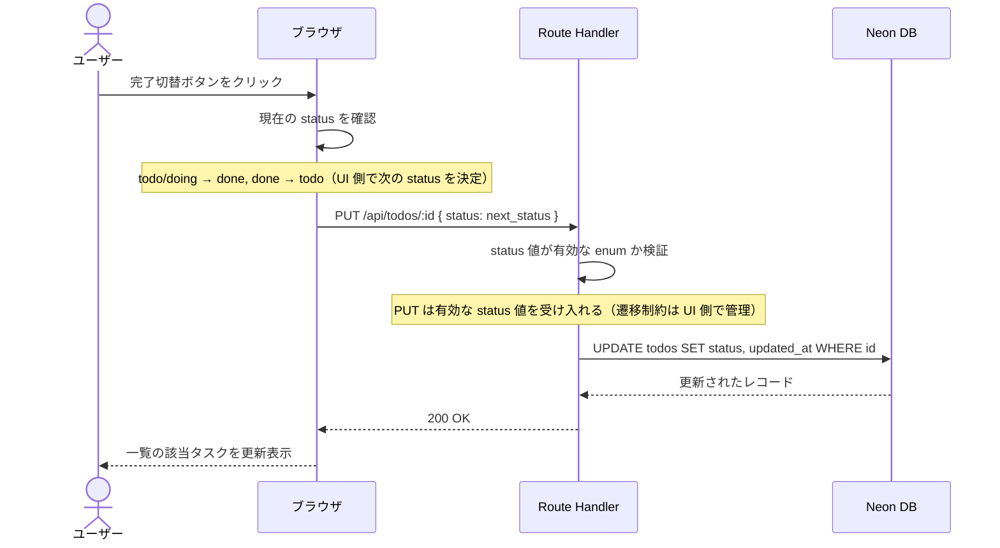
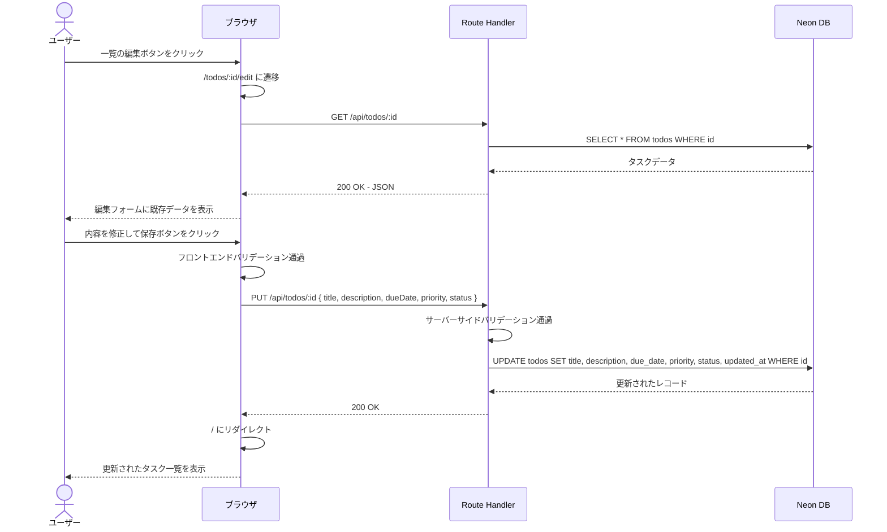
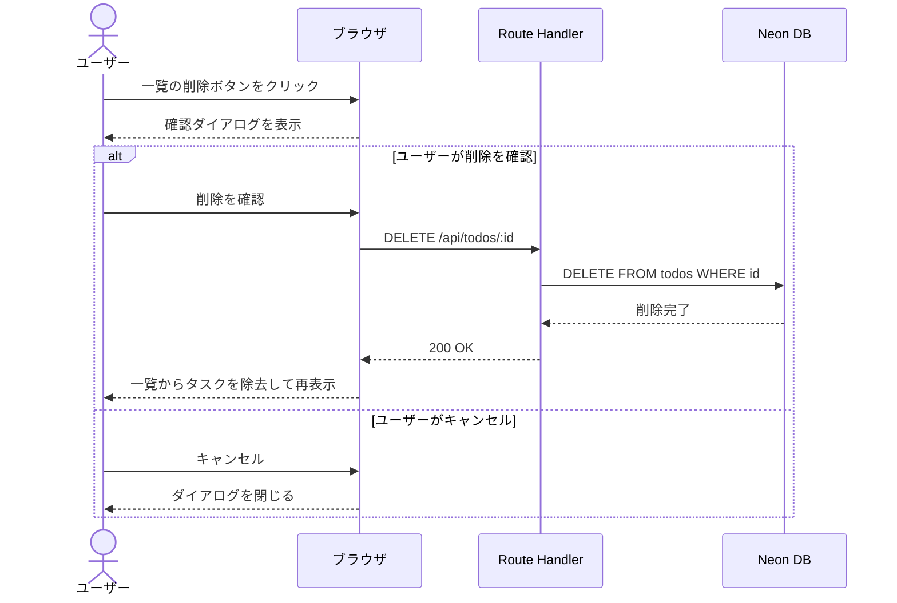
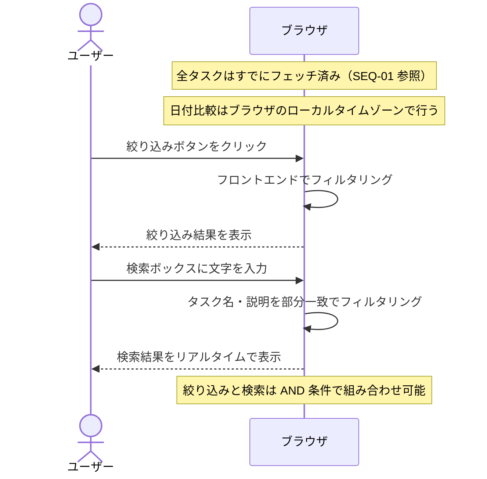

# シーケンス図

## API 契約（確定版）

| メソッド | パス | 説明 |
|---------|------|------|
| GET | /api/todos | 一覧取得（v1 は全件取得のみ） |
| GET | /api/todos/:id | 1件取得（編集画面の初期表示用） |
| POST | /api/todos | 新規作成。body: `{ title, description, dueDate, priority, status }` |
| PUT | /api/todos/:id | 更新。body: `{ title, description, dueDate, priority, status }` |
| DELETE | /api/todos/:id | 削除 |

> **注記**: フィールド名は JSON は camelCase（`dueDate`）、DB カラムは snake_case（`due_date`）で使い分ける。  
> v1 の絞り込み・検索はフロントエンド側で行う（GET /api/todos は全件取得のみ）。

---

## 対象フロー

| No. | フロー名 | 対応UC |
|-----|----------|--------|
| SEQ-01 | タスク一覧表示 | UC-01 |
| SEQ-02 | タスク追加（正常系） | UC-02 |
| SEQ-03 | タスク追加（バリデーション） | UC-02 |
| SEQ-04 | タスク状態変更（完了切替） | UC-03 |
| SEQ-05 | タスク編集 | UC-04 |
| SEQ-06 | タスク削除 | UC-05 |
| SEQ-07 | 絞り込み・検索 | UC-06, UC-07 |

---

## SEQ-01: タスク一覧表示

---

## SEQ-02: タスク追加（正常系）

---

## SEQ-03: タスク追加（バリデーション）

---

## SEQ-04: タスク状態変更（完了切替）

---

## SEQ-05: タスク編集

---

## SEQ-06: タスク削除

---

## SEQ-07: 絞り込み・検索

