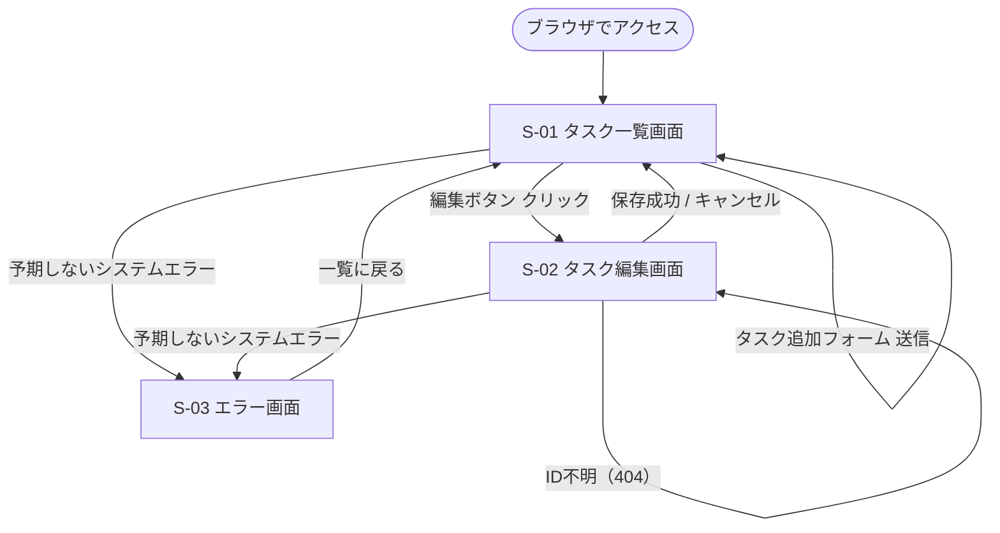
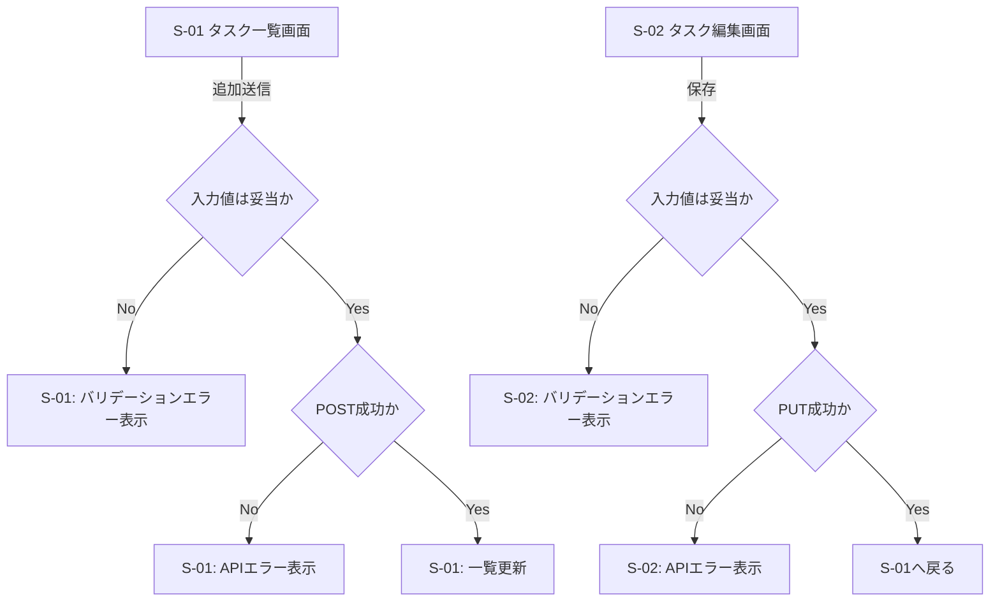

# UI 設計

## 画面一覧

| 画面ID | 画面名 | URL | 説明 |
|--------|--------|-----|------|
| S-01 | タスク一覧画面 | `/` | メイン画面。追加フォーム・絞り込み・検索・一覧 |
| S-02 | タスク編集画面 | `/todos/:id/edit` | 既存タスクの編集 |
| S-03 | エラー画面 | 自動 | 500 システムエラー時（Next.js error.tsx） |

---

## 画面遷移図



---

## フォーム操作の成否フロー



---

## S-01: タスク一覧画面

### レイアウト構成

```
┌─────────────────────────────────────────────┐
│  Simple Todo App               [ヘッダー]    │
├─────────────────────────────────────────────┤
│  ┌───────────────────────────────────────┐  │
│  │ タスク追加フォーム                    │  │
│  │  タスク名* [_______________]          │  │
│  │  説明      [_______________]          │  │
│  │  締切日    [____] 優先度 [▼]          │  │
│  │                         [追加する]    │  │
│  └───────────────────────────────────────┘  │
├─────────────────────────────────────────────┤
│  [すべて][未着手][進行中][完了][期限切れ]    │
│  [今日まで][高優先度]  🔍[検索____________]  │
├─────────────────────────────────────────────┤
│  タスク一覧                                  │
│  ┌─────────────────────────────────────┐    │
│  │ ☑ タスク名           [高] 2024/4/15 │    │
│  │   説明テキスト...    未着手          │    │
│  │                    [編集] [削除]     │    │
│  ├─────────────────────────────────────┤    │
│  │ ☑ タスク名（期限切れ）[中] ─────── │    │
│  │   説明テキスト...    進行中 ⚠期限切れ│    │
│  │                    [編集] [削除]     │    │
│  ├─────────────────────────────────────┤    │
│  │ ✅ 完了済みタスク     [低]           │    │
│  │   説明テキスト...    完了            │    │
│  │                    [編集] [削除]     │    │
│  └─────────────────────────────────────┘    │
└─────────────────────────────────────────────┘
```

### コンポーネント詳細

#### タスク追加フォーム
| 項目 | 種類 | バリデーション |
|------|------|---------------|
| タスク名 | テキスト（必須） | 1〜200文字 |
| 説明 | テキストエリア（任意） | 0〜1000文字 |
| 締切日 | 日付 input（任意） | 有効な日付 |
| 優先度 | セレクト（低・中・高） | 初期値: 中 |
| 状態 | 非表示（初期値: 未着手） | — |

#### 絞り込みボタン
- タブ形式で 7 種類（すべて / 未着手 / 進行中 / 完了 / 期限切れ / 今日まで / 高優先度）
- 選択中のタブはハイライト表示

#### 検索ボックス
- プレースホルダー: 「タスク名・説明で検索」
- リアルタイムフィルタリング（入力のたびに絞り込む）
- 絞り込みボタンとの AND 条件
- 「期限切れ」「今日まで」の日付比較はブラウザのローカルタイムゾーンで行う

#### タスク行
| 要素 | 内容 |
|------|------|
| チェックボックス/アイコン | todo / doing はクリックで done、done はクリックで todo に戻す（doing には戻さない） |
| タスク名 | テキスト表示 |
| 優先度バッジ | 高・中・低 |
| 締切日 | YYYY/MM/DD 形式（未設定時は「─」） |
| 作成日時 | YYYY/MM/DD HH:mm 形式 |
| 期限切れバッジ | 締切超過 & 未完了時に「⚠ 期限切れ」を赤表示 |
| 状態 | 未着手 / 進行中 / 完了 |
| 編集ボタン | 編集画面へ遷移 |
| 削除ボタン | 確認ダイアログ後に削除 |

### 一覧の表示ルール
- 未完了（todo / doing）を上、完了（done）を下に表示する
- 同グループ内は締切日昇順で表示する
- 締切日未設定は末尾に寄せる
- 同順位の場合は作成日時（created_at）降順で表示する

### 例外状態
| 状態 | 表示 |
|------|------|
| タスク0件 | 「タスクがありません。追加してください」を一覧領域に表示 |
| 追加のバリデーションエラー | 各項目直下にエラーメッセージを表示（API は呼ばない） |
| 一覧取得失敗（API エラー） | 一覧領域に再試行導線付きエラーメッセージを表示 |
| 削除失敗 | エラーメッセージで通知し、一覧は変更しない |

---

## S-02: タスク編集画面

### レイアウト構成

```
┌─────────────────────────────────────────────┐
│  Simple Todo App               [ヘッダー]    │
├─────────────────────────────────────────────┤
│  ← 一覧に戻る                               │
│                                             │
│  タスク編集                                 │
│  ┌───────────────────────────────────────┐  │
│  │  タスク名*  [_________________________] │
│  │  説明       [_________________________] │
│  │             [_________________________] │
│  │  締切日     [______]                    │
│  │  優先度     [▼ 低・中・高]             │
│  │  状態       [▼ 未着手・進行中・完了]   │
│  │                                        │
│  │         [キャンセル]  [保存する]       │
│  └───────────────────────────────────────┘  │
└─────────────────────────────────────────────┘
```

### 初期データ読み込み
1. ページ表示時に GET /api/todos/:id を呼んで既存データを取得する
2. 取得中はフォームをローディング表示（ボタン無効化）する
3. 取得成功時: 各フィールドを取得値で初期化する
4. 取得失敗（404）: 「タスクが見つかりません」を表示し、一覧への戻りリンクを示す
5. 取得失敗（その他エラー）: エラーメッセージを表示する

### コンポーネント詳細

| 項目 | 種類 | バリデーション |
|------|------|---------------|
| タスク名 | テキスト（必須） | 1〜200文字 |
| 説明 | テキストエリア（任意） | 0〜1000文字 |
| 締切日 | 日付 input（任意） | 有効な日付 |
| 優先度 | セレクト（低・中・高） | — |
| 状態 | セレクト（未着手・進行中・完了） | — |

- 「← 一覧に戻る」リンク: キャンセルと同じ効果（変更を保存しない）
- 「キャンセル」ボタン: 一覧画面に戻る
- 「保存する」ボタン: バリデーション後 PUT /api/todos/:id を呼び、一覧に戻る

### 例外状態
| 状態 | 表示 |
|------|------|
| 編集対象タスクが存在しない（404） | 「タスクが見つかりません」を表示し、一覧への戻りリンクを表示 |
| 編集のバリデーションエラー | 各項目直下にエラーメッセージを表示（API は呼ばない） |
| 保存失敗（API エラー） | フォーム上部にエラーメッセージを表示し、フォームは維持 |

---

## 状態・優先度の日本語表示マッピング

| 内部値 | 画面表示 |
|--------|----------|
| `todo` | 未着手 |
| `doing` | 進行中 |
| `done` | 完了 |
| `low` | 低 |
| `medium` | 中 |
| `high` | 高 |

---

## 非機能・スタイル方針

- スタイリング: Tailwind CSS（暫定）
- レスポンシブ: モバイル対応（min-width 320px）
- アクセシビリティ: ボタンに `aria-label` を付与する
- ローディング: API 呼び出し中はボタンを無効化する
