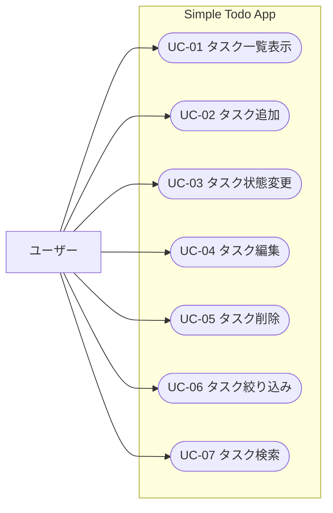

# ユースケース定義

## アクターと対象システム

| アクター | 説明 |
|----------|------|
| ユーザー | 個人利用者（認証なし・単一ユーザー） |

## ユースケース図

## ユースケース一覧

| ID | ユースケース名 | 概要 | 優先度 |
|----|----------------|------|--------|
| UC-01 | タスク一覧表示 | 登録済みタスクを未完了優先・締切近い順で一覧表示する | 高 |
| UC-02 | タスク追加 | タスク名（必須）・説明・締切日・優先度を入力し、状態は未着手で登録する | 高 |
| UC-03 | タスク状態変更 | 一覧からワンクリックで状態切替、または編集画面で状態変更する | 高 |
| UC-04 | タスク編集 | 登録済みタスクの全項目を別ページで修正する | 高 |
| UC-05 | タスク削除 | 確認メッセージ表示後に物理削除する | 高 |
| UC-06 | タスク絞り込み | すべて / 未着手 / 進行中 / 完了 / 期限切れ / 今日まで / 高優先度 で絞り込む | 中 |
| UC-07 | タスク検索 | タスク名・説明の部分一致でフィルタリングする | 中 |

## ユースケース詳細

### UC-01 タスク一覧表示

- **事前条件**: なし
- **主成功シナリオ**:
  1. ユーザーがアプリにアクセスする
  2. サーバーが todos テーブルを全件取得する（GET /api/todos）
  3. 以下の並び順で一覧表示する:
     - 未完了（todo / doing）を上、完了（done）を下
     - 同グループ内は due_date 昇順（null は末尾、その次は created_at 降順）
  4. 各行に完了切替・編集・削除ボタンを表示する
- **表示項目**: タスク名 / 説明 / 締切日 / 優先度 / 状態 / 作成日時
- **期限切れ表示**: due_date < 今日 かつ status ≠ done のタスクに「期限切れ」バッジを表示する
- **代替・例外シナリオ**:
  - タスクが0件の場合: 「タスクがありません。追加してください」を表示する
  - API 失敗時: エラーメッセージを表示する

### UC-02 タスク追加

- **事前条件**: なし
- **主成功シナリオ**:
  1. ユーザーがタスク追加フォームに入力する
  2. バリデーションを通過したら POST /api/todos を呼ぶ
  3. 一覧が更新される
- **バリデーション**:
  - タスク名: 1〜200文字（必須）
  - 説明: 0〜1000文字（任意）
  - 締切日: 有効な日付（任意）
- **代替・例外シナリオ**:
  - バリデーションエラー時: フォーム下部にエラーメッセージを表示する（API は呼ばない）
  - API 失敗時: エラーメッセージを表示する

### UC-03 タスク状態変更

- **事前条件**: タスクが存在すること
- **ワンクリック切替ルール（一覧から）**:
  - `todo` または `doing` → `done` に変更する
  - `done` → `todo` に変更する（doing に戻さない）
  - `doing` への変更は編集画面からのみ行う
- **主成功シナリオ（ワンクリック）**:
  1. ユーザーが一覧の完了切替ボタンをクリックする
  2. 上記ルールに従って PUT /api/todos/:id で status を更新する
  3. 一覧が更新される
- **代替**: 編集画面から任意の状態（todo / doing / done）に変更可能

### UC-04 タスク編集

- **事前条件**: タスクが存在すること
- **主成功シナリオ**:
  1. ユーザーが一覧の編集ボタンをクリックする
  2. 編集ページ `/todos/:id/edit` に遷移する
  3. GET /api/todos/:id で既存データを取得して入力欄に表示する
  4. ユーザーが修正して保存する
  5. PUT /api/todos/:id を呼ぶ
  6. 一覧ページ `/` にリダイレクトする
- **代替・例外シナリオ**:
  - 対象タスクが存在しない場合（既に削除済み）: 404 ページまたはエラーメッセージを表示する

### UC-05 タスク削除

- **事前条件**: タスクが存在すること
- **主成功シナリオ**:
  1. ユーザーが一覧の削除ボタンをクリックする
  2. 確認ダイアログを表示する
  3. ユーザーが削除を確認する
  4. DELETE /api/todos/:id を呼ぶ
  5. 一覧から当該タスクが消える
- **代替シナリオ**: ユーザーがキャンセルした場合、削除しない
- **代替・例外シナリオ**:
  - API 失敗時: エラーメッセージを表示し、一覧は変更しない

### UC-06 タスク絞り込み

- **事前条件**: なし
- **絞り込み条件**:

| フィルター名 | 条件 |
|------------|------|
| すべて | 全件 |
| 未着手 | status = todo |
| 進行中 | status = doing |
| 完了 | status = done |
| 期限切れ | due_date < 今日 AND status ≠ done |
| 今日まで | due_date <= 今日 AND status ≠ done |
| 高優先度 | priority = high |

- **実装方針**: フロントエンド側でフィルタリング（初版）
  - GET /api/todos は全件取得のみ（v1 では検索クエリパラメーターを使わない）

### UC-07 タスク検索

- **事前条件**: なし
- **主成功シナリオ**:
  1. ユーザーが検索ボックスに文字を入力する
  2. タスク名・説明を部分一致でリアルタイムフィルタリングする
- **実装方針**: フロントエンド側でフィルタリング（初版）
  - 絞り込み（UC-06）との AND 条件で組み合わせ可能
